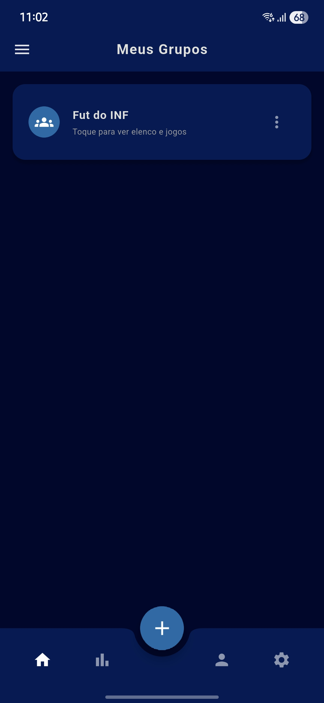
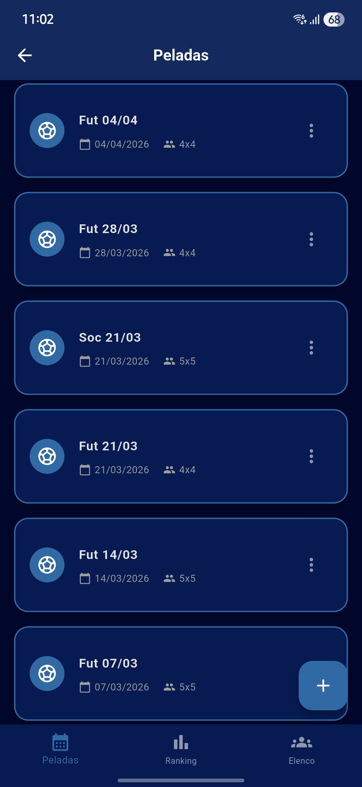
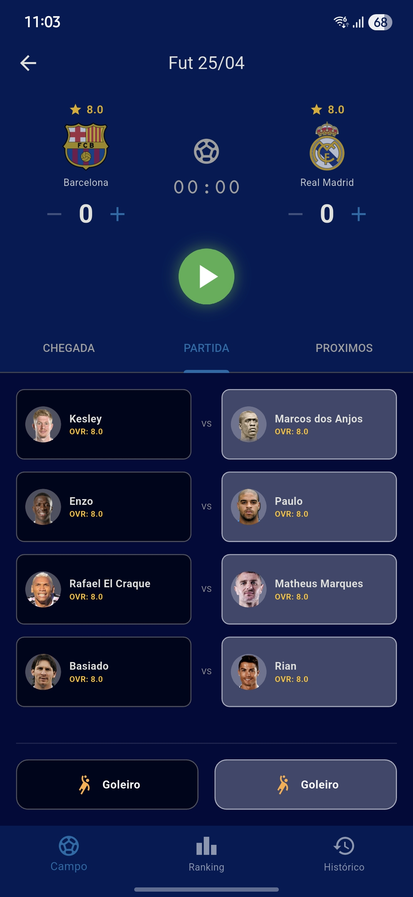
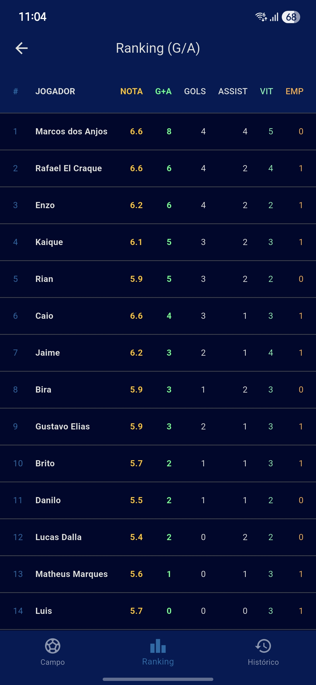
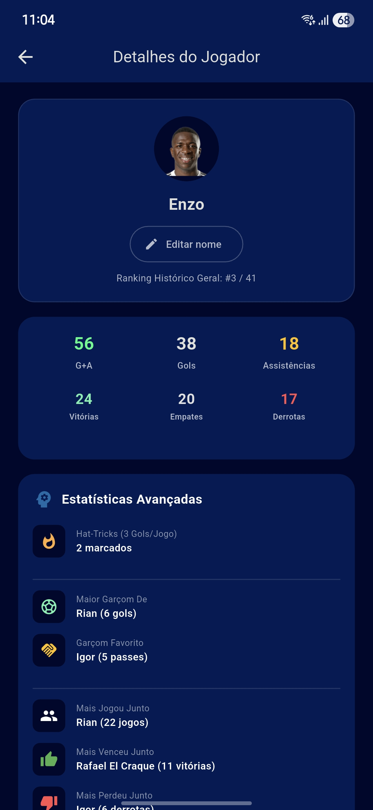
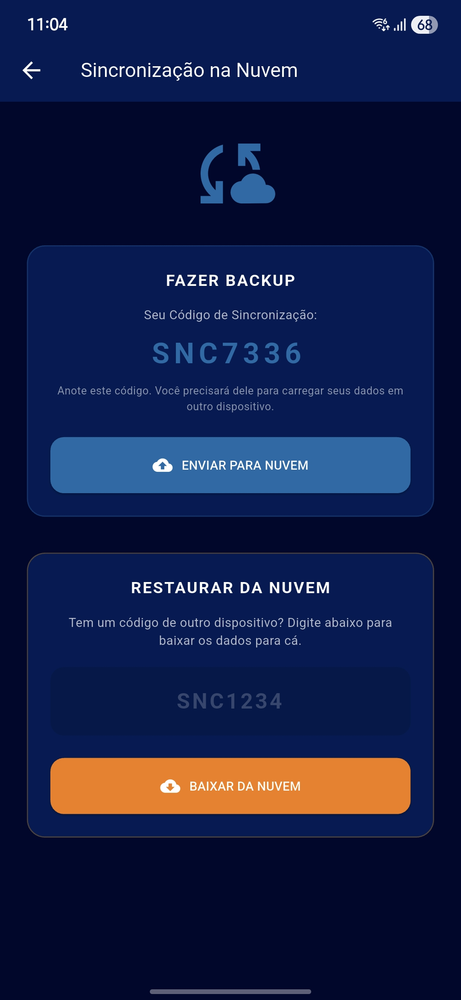

<h1 align="center">⚽ Pelada Manager</h1>

<p align="center">
  A Flutter app for managing your <em>pelada</em> (casual football match) groups — track players, organize teams, score matches, and view rankings, all from your phone.
</p>

<p align="center">
  
  
  
  
</p>

---

## 📸 Screenshots

| Home | Sessions | Live Match |
|:----:|:--------:|:----------:|
|  |  |  |

| Rankings | Player Detail | Sync |
|:--------:|:-------------:|:----:|
|  |  |  |

---

## 📱 Features

### 🏘️ Group Management
- Create multiple football groups (e.g., "Futebol de Quinta")
- Each group has its own independent roster, sessions, and statistics

### 📅 Sessions (Peladas)
- Create match sessions with a name, date, and players-per-team count
- Sessions are sorted newest-first and display live/finished status
- Configurable match duration (in minutes)

### ⚔️ Live Match Screen
- **Arrival Queue** — Add players as they show up; drag to reorder the queue
- **Random Team Draw** — Shuffle players into two balanced teams instantly
- **Live Scoreboard** — Real-time score tracker with timer (overtime detection)
- **In-game Events** — Log goals and assists per player during the match
- **Goal Scorers Panel** — See scorer names and timestamps displayed below the scoreboard
- **Goalkeeper Rotation** — Swap goalkeepers from the waiting list mid-match
- **Next Teams** — Preview which players are up next while the current match is live
- Audio whistle sound on match start and end

### 👤 Player Management
- Full player roster per group with custom icons and star ratings (1–5)
- Player detail page with:
  - All-time stats: Goals, Assists, G+A, Wins, Draws, Losses
  - Win/draw/loss ratio bar
  - **Advanced stats**: hat-tricks, favourite assist partner, most wins/losses with a teammate, biggest rival, most frequent opponent

### 🏆 Rankings
- Group-wide leaderboard with sortable columns: G+A, Goals, Assists, Wins, Draws, Losses, Games
- Filter by month to view period-specific standings
- Medal icons (🥇🥈🥉) for the top 3 players
- Per-session tournament ranking screen

### 📤 Data Sync & Backup
- **Cloud Sync** via Firebase Firestore — sync your data across devices using a personal sync code
- **Export / Import** — save your full database as a JSON file and restore it on any device

---

## 🛠️ Tech Stack

| Layer | Technology |
|---|---|
| Framework | Flutter (Material 3, dark theme) |
| Language | Dart 3 |
| Local Storage | `shared_preferences` |
| Cloud Sync | Firebase Firestore (`cloud_firestore`) |
| Audio | `audioplayers` |
| File I/O | `file_picker` + `path_provider` |
| Sharing | `share_plus` |
| IDs | `uuid` |

---

## ⬇️ Download

Grab the latest release APK directly from the [Releases page](../../releases/latest) — no build tools needed.

---

## 🚀 Getting Started

### Prerequisites
- [Flutter SDK](https://docs.flutter.dev/get-started/install) ≥ 3.10
- Android SDK / Android device or emulator
- A Firebase project with Firestore enabled (for cloud sync)

### Setup

```bash
# 1. Clone the repository
git clone https://github.com/rafffaelbs/App-Fut.git
cd App-Fut

# 2. Install dependencies
flutter pub get

# 3. Run on a connected device or emulator
flutter run
```

> **Note:** Cloud Sync requires a valid `google-services.json` file placed in `android/app/`. See [Firebase setup](https://firebase.google.com/docs/flutter/setup) for instructions.

### Build Release APK

```bash
flutter build apk --release
```

The APK will be generated at `build/app/outputs/flutter-apk/app-release.apk`.

---

## 📁 Project Structure

```
lib/
├── main.dart               # App entry point, group management home screen
├── firebase_options.dart   # Firebase configuration (auto-generated)
├── constants/
│   └── app_colors.dart     # Centralized color palette
├── screens/
│   ├── match_screen.dart          # Live match with timer, teams, events
│   ├── sessions_screen.dart       # List of sessions per group
│   ├── players_screen.dart        # Player roster management
│   ├── player_detail.dart         # Individual player stats & advanced analytics
│   ├── group_ranking_screen.dart  # Group leaderboard (sortable, filterable)
│   ├── group_dashboard_screen.dart
│   ├── tournament_screen.dart
│   ├── tournament_dashboard_screen.dart
│   ├── history_screen.dart
│   ├── ranking_screen.dart
│   ├── sync_screen.dart           # Cloud sync with Firebase
│   ├── edit_match_screen.dart
│   └── blank_screen.dart
├── services/
│   └── sync_service.dart   # Export/import JSON + Firebase sync logic
├── utils/
│   └── player_identity.dart # Stable player ID resolution helpers
└── widgets/
    └── match/
        ├── match_scoreboard.dart
        └── player_field_slot.dart
```

---

## 🤝 Contributing

Contributions, issues, and feature requests are welcome!

1. Fork the repository
2. Create your feature branch: `git checkout -b feature/my-feature`
3. Commit your changes: `git commit -m 'feat: add my feature'`
4. Push to the branch: `git push origin feature/my-feature`
5. Open a Pull Request

---

## 📄 License

This project is open source. See the [LICENSE](LICENSE) file for details.
